# Screenshot Gallery

Every screen of Content Sync Pro 1.2.0, captured from a live Strapi 5.52 admin
panel connected to a second running instance. Nothing here is a mockup — the
counts, profiles, run history and log rows are from a real sync between two
databases.

The plugin mounts at `/admin/plugins/strapi-content-sync-pro`; each heading below
gives the route so you can jump straight to the equivalent screen in your own
install. See [Admin UI Navigation](../README.md#admin-ui-navigation) for how the
navigation is organised.

## Contents

**Start** — [Home](#home) · [Setup 1: Connect](#setup-1-connect) · [Setup 2: Choose scope](#setup-2-choose-scope) · [Setup 3: Run](#setup-3-run)
**Run** — [Run profiles](#run-profiles) · [Bulk transfer](#bulk-transfer) · [Media](#media)
**Set up** — [Connection](#connection) · [Content types](#content-types) · [Sync profiles](#sync-profiles) · [Advanced](#advanced)
**Monitor** — [Stats](#stats) · [Logs](#logs) · [Help](#help)

---

## Start

### Home

`/` — the hub. A status banner reports whether the remote is reachable, which
deployment mode is active, and the remote URL; below it, one card per
destination grouped exactly as the primary navigation is. On a fresh install the
banner instead invites you into the Setup wizard.

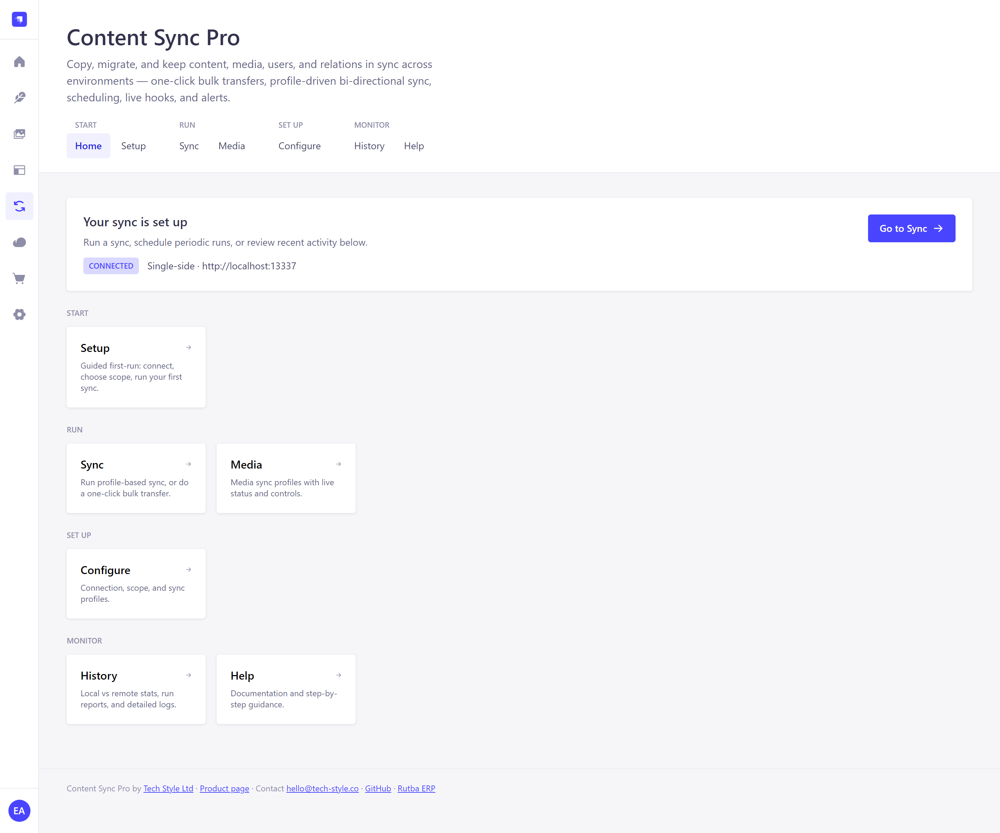

### Setup 1: Connect

`/setup/connect` — step one of the guided first run. The stepper across the top
tracks progress, and each step is its own URL, so the browser back button moves
between them. This step embeds the same connection form as Configure →
Connection; enforcement and alerts are deliberately left out until later.

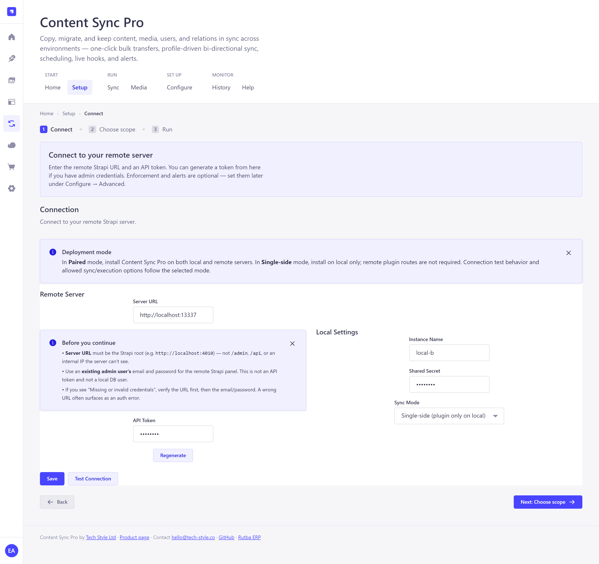

### Setup 2: Choose scope

`/setup/scope` — toggle on the content types to keep in sync. Each row shows its
UID, how many profiles exist for it, and which profile is currently active.
Enabling a type can pull in its direct dependencies (depth 1) so its relations
have somewhere to point.

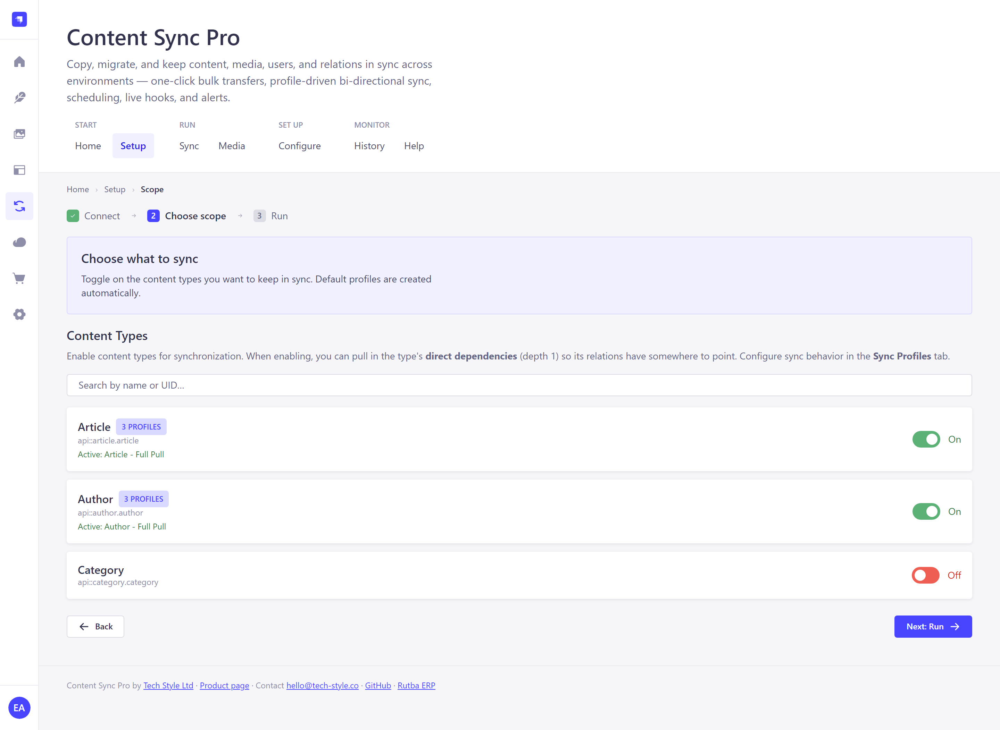

### Setup 3: Run

`/setup/run` — review the generated profiles and run them. The dependency badges
read "N profiles depend on this (executes earlier)" and "depends on N other
profiles (executes later)", which is what drives the execution order. **Finish**
hands off to the full Sync screen.

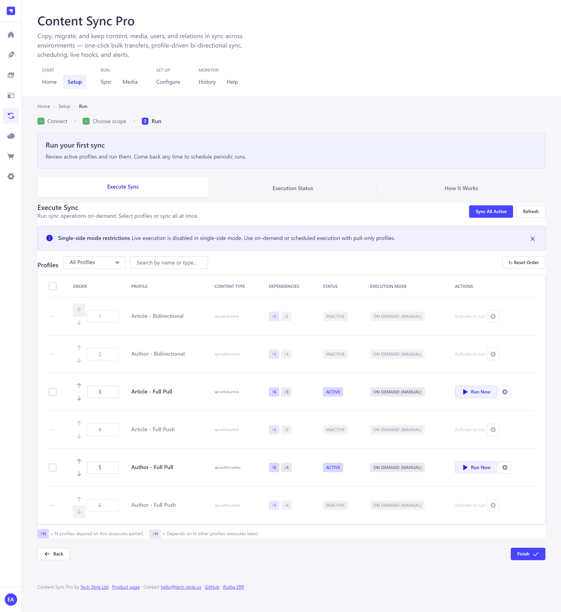

---

## Run

### Run profiles

`/sync` — the main execution screen, with sub-tabs for **Execute Sync**,
**Execution Status** and **How It Works**. Profiles can be reordered, filtered
and searched; each row exposes **Run Now** and a gear for per-profile execution
settings (on-demand, scheduled, or live). Inactive profiles show "Activate to
run" instead. Mode restrictions are surfaced inline — here, single-side mode
disables live execution.

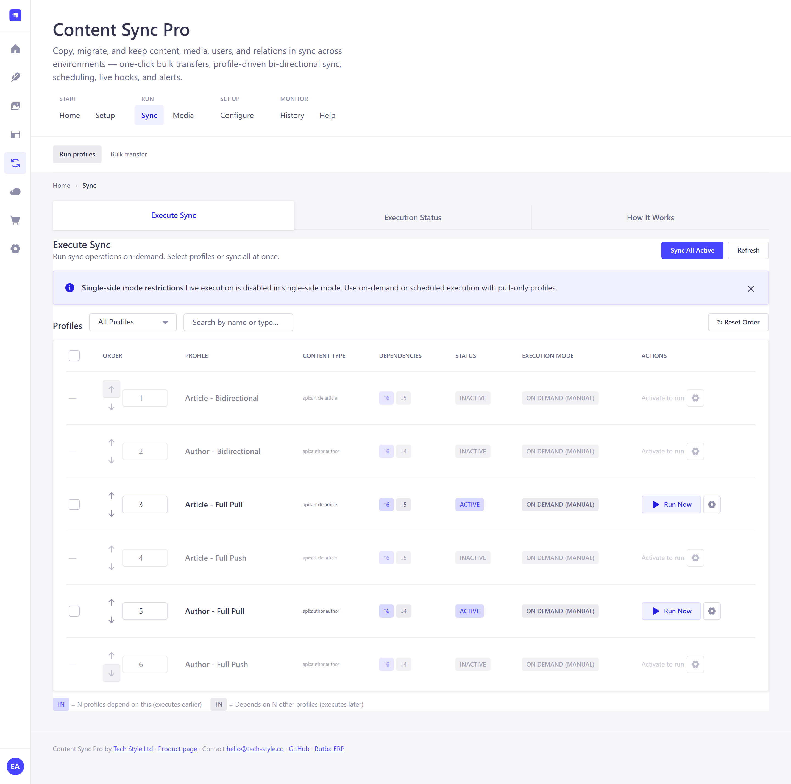

### Bulk transfer

`/sync/bulk` — one-click full pull or full push for first-time seeding and large
migrations. Choose direction, conflict strategy and scope (user-generated
content, media, Strapi users, admin users), then review the plan before starting:
the run expands into one chunk per content type per pass — entities first, then
relations — which you can select individually or step through manually. Runs
pause after the current page, cancel without losing progress, and resume later
from the saved cursor.

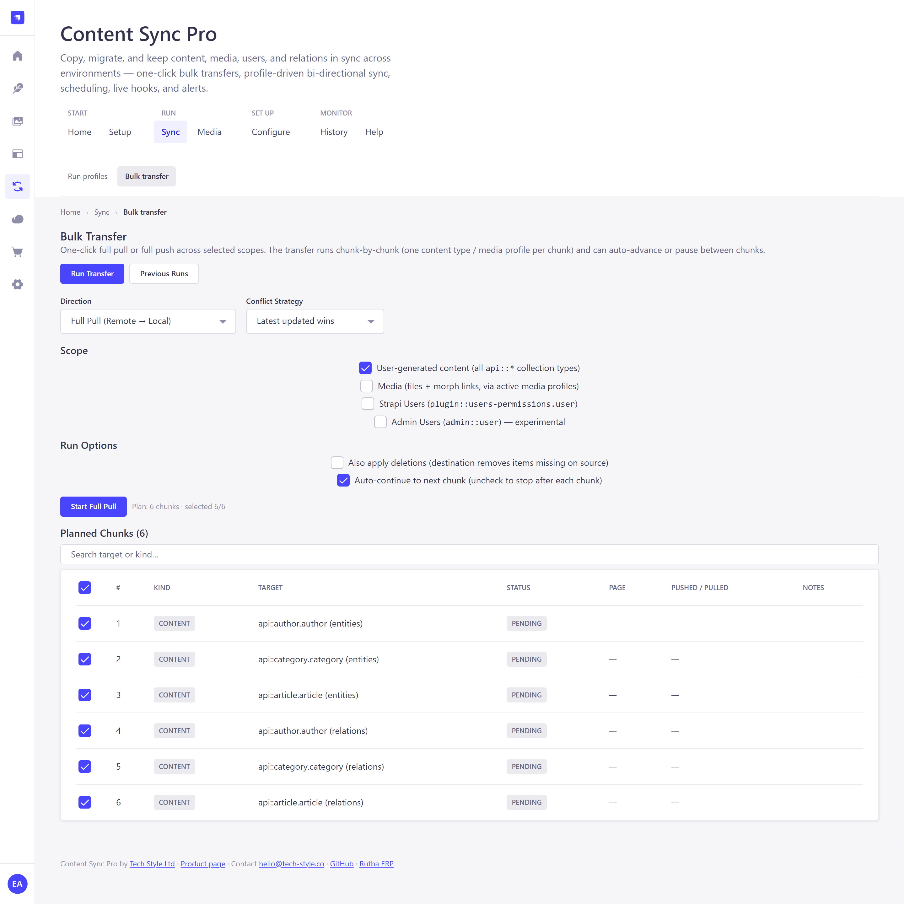

### Media

`/media` — profile-based media synchronisation for `plugin::upload.file`, syncing
both the database rows and the file bytes. Each profile carries its own strategy
(`url` or `rsync`), direction, conflict rule, execution mode and sync scope. The
**Status** sub-tab polls every 2 seconds during a run and shows live phase and
counters, with pause / resume / stop for long transfers.

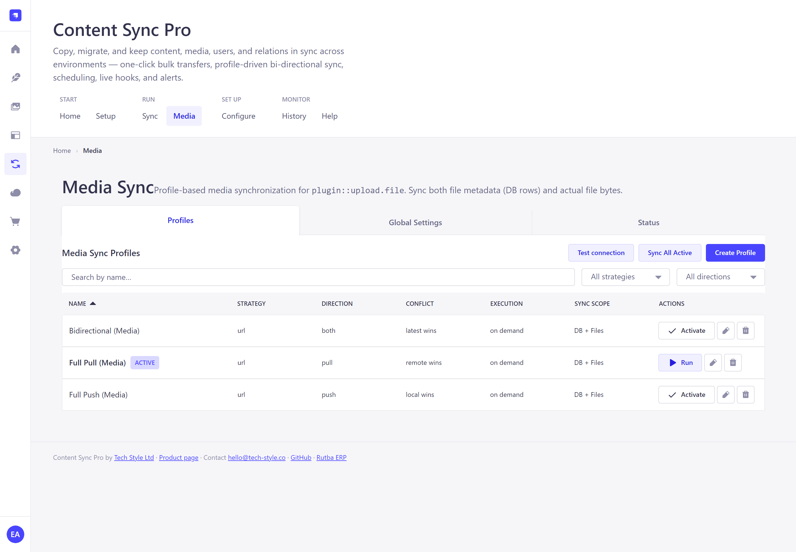

---

## Set up

### Connection

`/configure/connection` — the remote server URL and API token on the left, local
identity and deployment mode on the right. Secrets are masked (`••••••••`) in
every API response, so the form shows placeholders rather than values.
**Test Connection** validates before you save, and the callouts warn about the
two most common setup mistakes: pointing at `/admin` or `/api` instead of the
Strapi root, and confusing an API token with admin credentials.

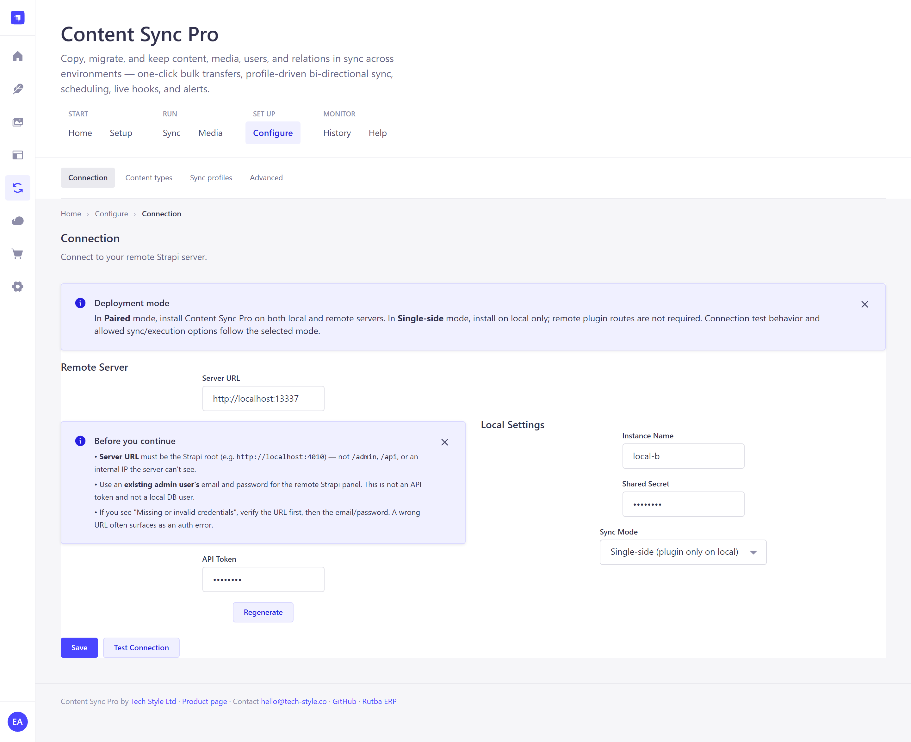

### Content types

`/configure/content-types` — the full list of syncable content types with a
toggle each. Turning one on auto-generates its three default profiles (Full Push,
Full Pull, Bidirectional) and the row then reports which one is active.

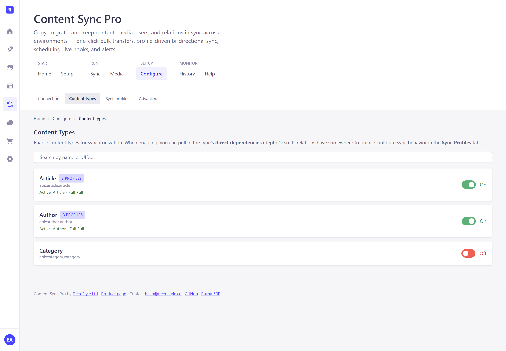

### Sync profiles

`/configure/profiles` — profiles define **what** syncs and **how** conflicts
resolve. The table shows direction, conflict strategy, simple/two-pass mode and
active state, with search and direction/status filters. Editing a profile opens
field-level policies (both / push / pull / exclude per field). Deployment mode is
enforced here too — in single-side mode, push and bidirectional presets are
disabled.

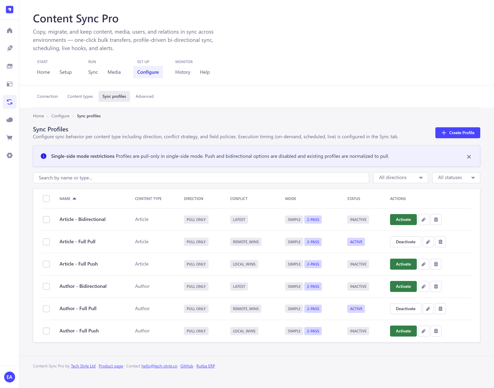

### Advanced

`/configure/advanced` — enforcement and alerts. Enforcement runs pre-sync
validation: schema match (strict / compatible / none), Strapi version check
(exact / minor / major / none) and server clock drift, with **Block on Failure**
deciding whether a failed check stops the run. Each check can be run on its own
and reports into the results panel. The **Alerts** sub-tab configures Strapi log,
email and webhook notifications.

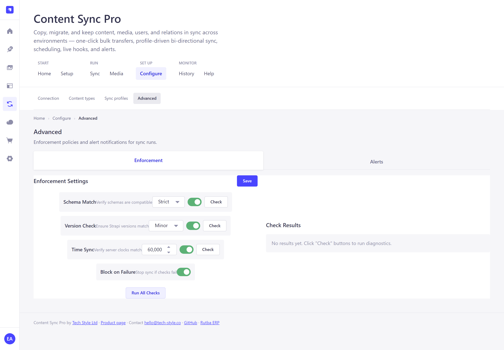

---

## Monitor

### Stats

`/history/stats` — **Current Snapshot** compares local and remote record counts
per content type, plus media files and morph rows, with the newest timestamp on
each side and which side is ahead. **Run Reports** keeps before/after snapshots
for each run. The action row handles retention: clear logs or reports manually,
or set Max Logs / Max Reports limits that are enforced after every sync.

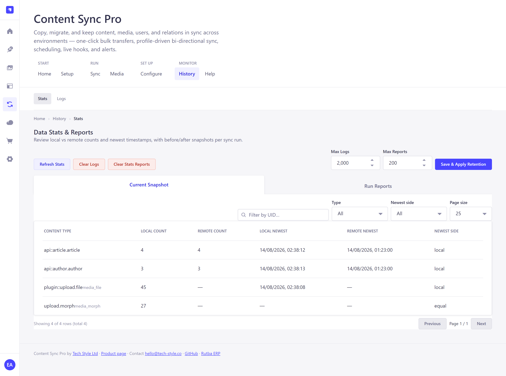

### Logs

`/history/logs` — every sync action as its own row: timestamp, action, content
type, status and the full result message, including per-run counters such as
`pushed`, `pulled`, `dbRows`, `links`, `skipped` and `errors`. Search across
action, content type and message, or filter by status to isolate a failing run.

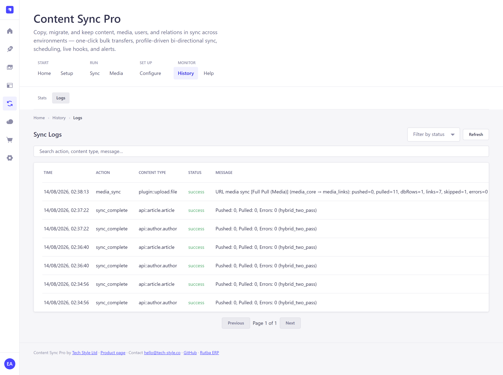

### Help

`/help` — the documentation built into the admin panel, tabbed by topic
(Overview, Configuration, Content Types, Sync Profiles, Sync Execution, Bulk
Transfer, Media, Stats, Enforcement, Alerts, Troubleshooting) with the intro
video embedded on the Overview tab. No need to leave Strapi to look something up.

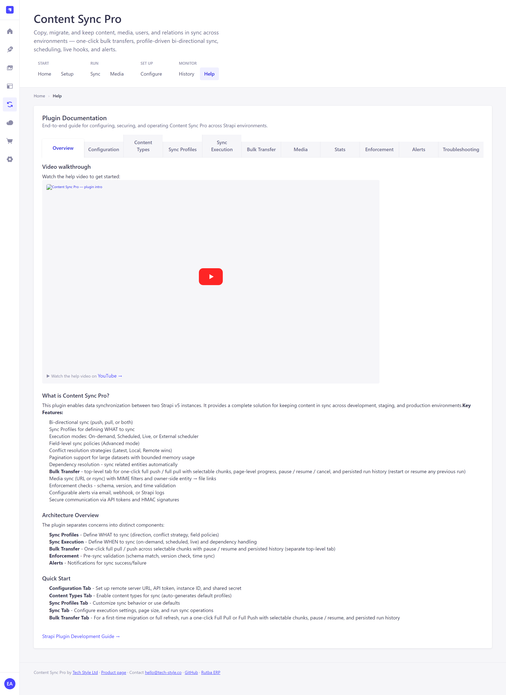
